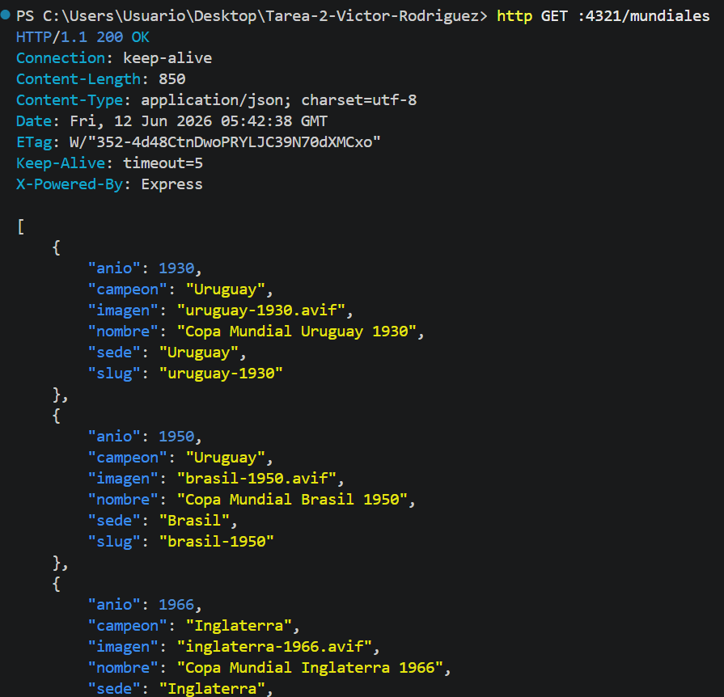
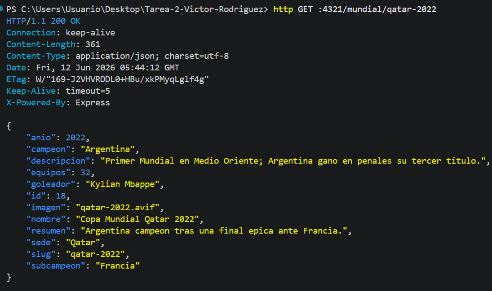
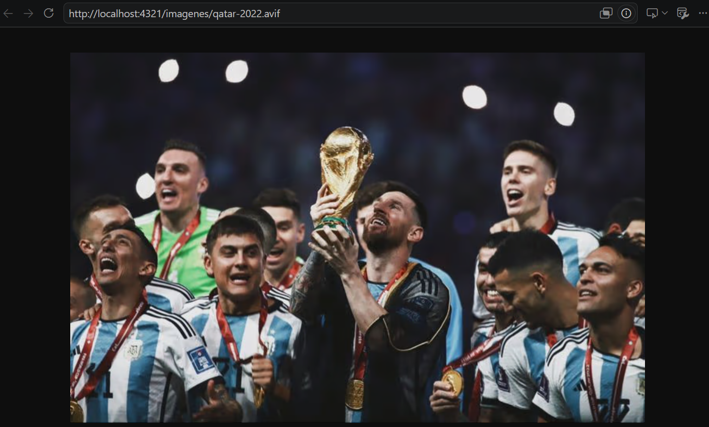

# Tarea-2-Victor-Rodriguez

# API Copa Mundial FIFA

API REST desarrollada con **Node.js**, **Express**, **SQLite (better-sqlite3)** y **Zod**, que permite consultar información sobre distintas ediciones de la Copa Mundial de la FIFA.

## Tecnologías utilizadas

- Node.js
- Express
- SQLite (better-sqlite3)
- Zod
- HTTPie (para pruebas)

## Requisitos

- Node.js v18 o superior
- npm

## Instalación

Clonar el repositorio:

```bash
git clone https://github.com/VictorRodz/Tarea-2-Victor-Rodriguez.git
cd Tarea-2-Victor-Rodriguez
```

Instalar dependencias:

```bash
npm install
```

## Poblar la base de datos

Ejecutar:

```bash
npm run seed
```

Este comando crea la base de datos SQLite ubicada en:

```text
data/mundiales.db
```

e inserta información de al menos seis ediciones de la Copa Mundial FIFA.

## Ejecutar la aplicación

Iniciar el servidor:

```bash
npm start
```

La API estará disponible en:

```text
http://localhost:4321
```

## Estructura del proyecto

```text
mundiales-api/
│
├── data/
│   └── mundiales.db
│
├── public/
│   └── imagenes/
│
├── src/
│   ├── db.js
│   ├── schemas.js
│   ├── seed.js
│   └── server.js
│
├── package.json
├── README.md
└── REFERENCIAS.md
```

## Endpoints disponibles

| Método | Ruta                    | Descripción                                             |
| ------ | ----------------------- | ------------------------------------------------------- |
| GET    | /                       | Información general de la API                           |
| GET    | /mundiales              | Lista resumida de mundiales                             |
| GET    | /mundiales?include=full | Lista completa de mundiales                             |
| GET    | /mundial/:slug          | Obtiene un mundial por su slug                          |
| GET    | /campeon/:pais          | Devuelve los slugs de los mundiales ganados por un país |
| GET    | /random                 | Devuelve una edición aleatoria                          |
| GET    | /search/:text           | Busca coincidencias por texto                           |
| GET    | /imagenes/*             | Acceso a imágenes estáticas                             |

## Códigos de respuesta

| Código          | Descripción                             |
| --------------- | --------------------------------------- |
| 200 OK          | La petición fue procesada correctamente |
| 400 Bad Request | Error de validación utilizando Zod      |
| 404 Not Found   | Recurso o ruta inexistente              |

## Ejemplos de prueba

```bash
http GET :4321/mundiales

http GET :4321/mundiales include==full

http GET :4321/mundial/qatar-2022

http GET :4321/mundial/inexistente

http GET :4321/campeon/Argentina

http GET :4321/random

http GET :4321/search/final

http GET :4321/search/ab
```


## Imágenes

Las imágenes de las ediciones mundialistas se encuentran en:

```text
public/imagenes/
```

y pueden visualizarse mediante URLs como:

```text
http://localhost:4321/imagenes/qatar-2022.avif
```

## Evidencias de pruebas

### GET /mundiales

Comando ejecutado:

```bash
http GET :4321/mundiales
```



---

### GET /mundial/qatar-2022

Comando ejecutado:

```bash
http GET :4321/mundial/qatar-2022
```



---

### GET /imagenes/qatar-2022.avif

Comando ejecutado:

```bash
http GET :4321/imagenes/qatar-2022.avif
```


---

### Visualización de imagen en navegador

Acceso mediante:

```text
http://localhost:4321/imagenes/qatar-2022.avif
```


